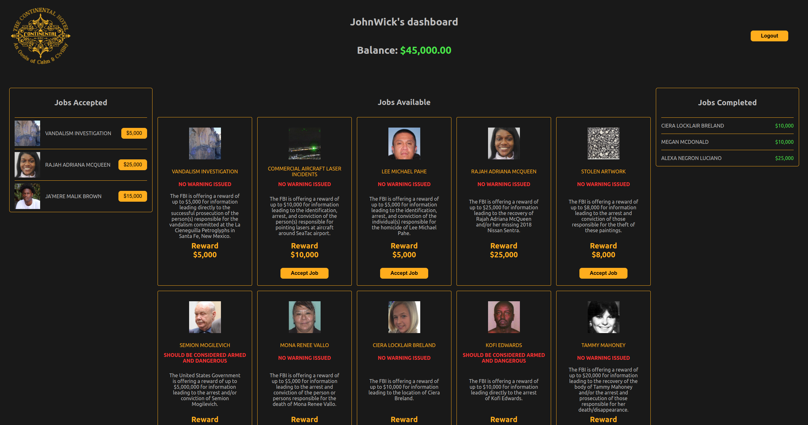

# Welcome to the Continental Network 🏨

# Project Description
This project was inspired by the John Wick movies.  
In the movies, the Continental is a chain of hotels located all around the world that function as a neutral territory for members of the criminal underworld, generally hitmen and high-end criminals.

- You can find out more about the Continental [here](https://johnwick.fandom.com/wiki/Continental_Hotel).

The app simulates a booking system where users can carry out contracts by choosing jobs from the list of jobs available. The jobs come from real unsolved FBI cases that are shared by the FBI itself through their public API.

- You can get to the FBI public API docs [here](https://api.fbi.gov/docs).

# Setup instructions
- If someone clones your project, what do they need to do to get it running?
- i.e .env set up, database setup, prisma commands, etc.

# Approach to implementation
- A few sentences on implementation and architecture.
- Briefly note what tech you used - React, express, postgres, etc.
- Note anything particularly interesting you want to highlight.

# Learnings
- Setting up a project from scratch
- Filtering data from a 3rd party API on the back end
- Authentication